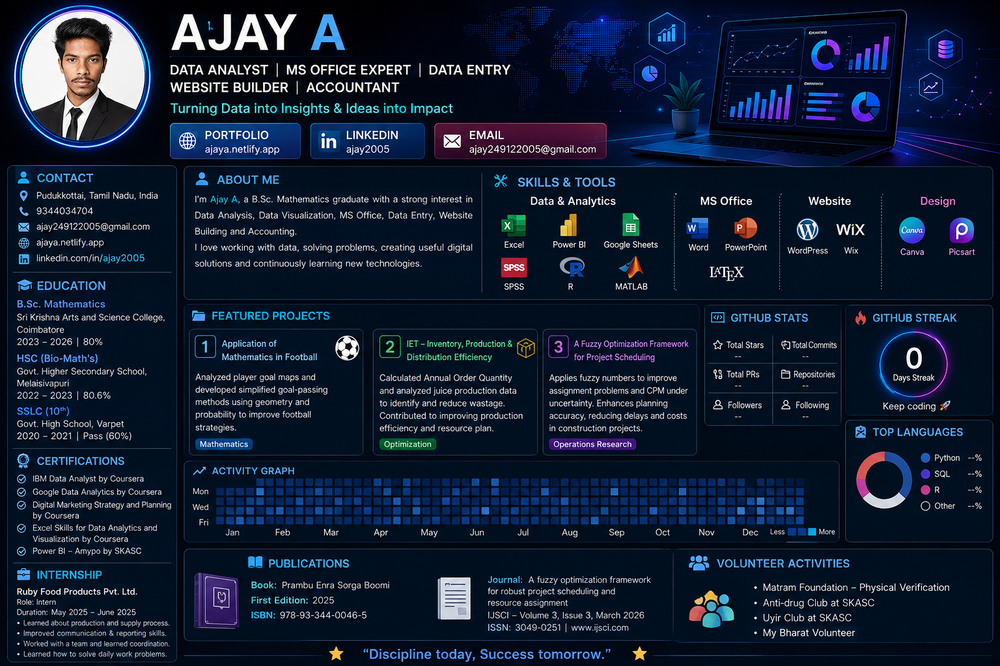

 
👋 Hi, I'm Ajay A

📊 Data Analyst • MS Office • Data Entry

🌐 Website Builder • Accountant

Turning Data into Insights & Ideas into Impact

 
---

🚀 About Me

I'm Ajay A, a B.Sc. Mathematics student with a strong interest in Data Analysis, Data Visualization, MS Office, Data Entry, Website Building and Accounting.

I enjoy working with data, solving problems, creating useful digital solutions and continuously learning new technologies.

💡 Areas of Interest

- 📊 Data Analysis & Data Visualization
- 📑 Microsoft Excel, Word & PowerPoint
- ⌨️ Data Entry & Documentation
- 🌐 Website Building
- 💼 Accounting & Business Data
- 📈 Power BI & Statistical Analysis
- 🎨 UI/UX Design

---

🛠️ Skills & Technologies

📊 Data Analysis

💻 Microsoft Office

🌐 Website & Design

---

📂 Featured Projects

⚽ Application of Mathematics in Football

Analyzed player goal maps and developed simplified goal-passing methods using mathematical concepts such as geometry and probability to improve football strategies.

📦 Inventory, Production & Distribution Efficiency

Calculated Annual Order Quantity and analyzed juice production data to identify and reduce wastage.

Contributed to improving production efficiency and resource planning.

📅 Fuzzy Optimization Framework

Applied fuzzy numbers to improve assignment problems and CPM under uncertainty.

The project focuses on improving planning accuracy and reducing delays and costs in construction projects.

---

🎓 Education

🎓 B.Sc. Mathematics

Sri Krishna Arts and Science College, Coimbatore

2023 – 2026 | 80%

📘 HSC – Bio-Mathematics

Govt. Higher Secondary School, Melaisivapuri

2022 – 2023 | 80.6%

📗 SSLC – 10th

Govt. High School, Varpet

2020 – 2021 | Pass / 60%

---

📜 Certifications

- 🏆 IBM Data Analyst — Coursera
- 🏆 Google Data Analytics — Coursera
- 🏆 Digital Marketing Strategy and Planning — Coursera
- 🏆 Excel Skills for Data Analytics and Visualization — Coursera
- 🏆 Power BI — Amypo by SKASC

---

💼 Internship

Ruby Food Products Pvt. Ltd.

Role: Intern
Duration: May 2025 – June 2025

Key Learnings

- Production and supply process
- Communication and reporting skills
- Team coordination
- Presentation skills
- Daily workplace problem solving

---

📚 Publications

📖 Book

Prambu Enra Sorga Boomi

First Edition: 2025

ISBN: 978-93-344-0046-5

📄 Journal Publication

A Fuzzy Optimization Framework for Robust Project Scheduling and Resource Assignment

Publisher: IJSCI

Volume 3, Issue 3 — March 2026

ISSN: 3049-0251

---

🌱 Volunteer Activities

- Matram Foundation — Physical Verification
- Anti-Drug Club — SKASC
- Uyir Club — SKASC
- My Bharat Volunteer

---

📊 GitHub Statistics

---

🔥 GitHub Streak

---

📈 Contribution Activity

---

🤝 Connect With Me

---

⭐ Thanks for visiting my profile!

🚀 Discipline today, Success tomorrow.

 
